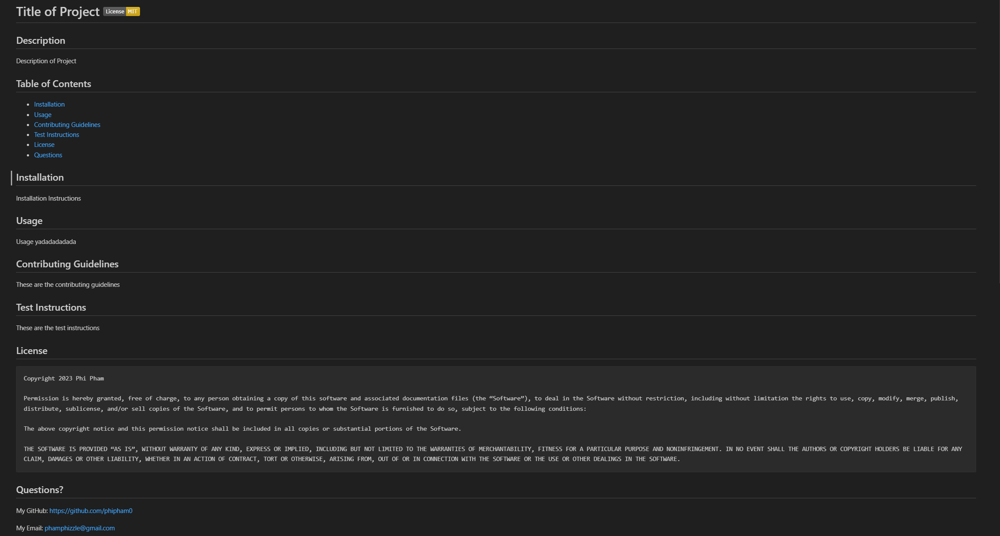

# Challenge 9: README Generator

## Description

The README Generator is an application that generates a README file named "generatedREADME.md" based on the responses of a series of prompts that the user can answer.

## Installation

To install the project, clone the repository onto your PC. Make sure to have Node.JS installed. The repository should have inquirer package installed already, but if it is not, run the command "npm install"
Enter the directory that has the cloned repository type "node index.js"

## Usage

To start, run the command "node index.js"
A series of 9 prompts will then show that the user can answer. Anything that the user inputs will show on the README file that is generated. To enter an answer, the user will press the "Enter" key.
When the user is asked to choose a license, the answer can be selected using the up and down arrow keys and pressing "Enter." After all the prompts are run through, "generatedREADME.md" will be made
and will be populated based on the answers chosen.

https://youtu.be/eGd5-WUZnDc?si=d7_15Qo67LHdBLKk

**SCREENSHOT**

**SCREENSHOT**

## License

MIT License

Copyright (c) 2023 Phi Pham

Permission is hereby granted, free of charge, to any person obtaining a copy
of this software and associated documentation files (the "Software"), to deal
in the Software without restriction, including without limitation the rights
to use, copy, modify, merge, publish, distribute, sublicense, and/or sell
copies of the Software, and to permit persons to whom the Software is
furnished to do so, subject to the following conditions:

The above copyright notice and this permission notice shall be included in all
copies or substantial portions of the Software.

THE SOFTWARE IS PROVIDED "AS IS", WITHOUT WARRANTY OF ANY KIND, EXPRESS OR
IMPLIED, INCLUDING BUT NOT LIMITED TO THE WARRANTIES OF MERCHANTABILITY,
FITNESS FOR A PARTICULAR PURPOSE AND NONINFRINGEMENT. IN NO EVENT SHALL THE
AUTHORS OR COPYRIGHT HOLDERS BE LIABLE FOR ANY CLAIM, DAMAGES OR OTHER
LIABILITY, WHETHER IN AN ACTION OF CONTRACT, TORT OR OTHERWISE, ARISING FROM,
OUT OF OR IN CONNECTION WITH THE SOFTWARE OR THE USE OR OTHER DEALINGS IN THE
SOFTWARE.

